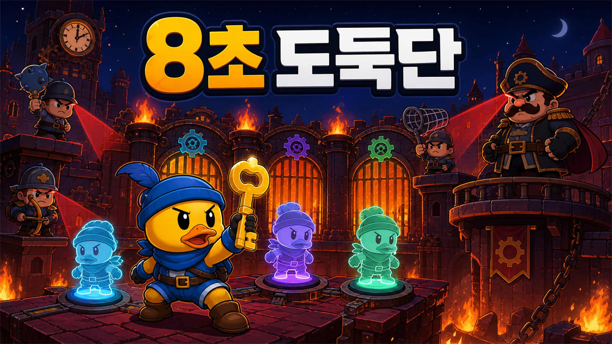

# 8초 도둑단



> **8초 전의 내가, 지금의 나를 돕는다.**
>
> 8초 동안 움직인 길을 분신으로 저장하고 과거의 나와 역할을 나눠 열쇠를 찾는 1인 협동 잠입 퍼즐

**OPENAI GAME 2026 제출작, v0.13.0**

[게임 바로 플레이](https://sdj3261.github.io/openai_game_2026/) | [3분 데모 영상](https://sdj3261.github.io/openai_game_2026/demo/) | [MP4 바로 보기](https://sdj3261.github.io/openai_game_2026/demo/8-second-crew-demo.mp4)

설치나 로그인 없이 PC와 모바일 브라우저에서 바로 플레이할 수 있습니다.

8초 도둑단은 8초 동안의 움직임을 분신으로 저장해 과거의 나와 협동하는 잠입 퍼즐 게임입니다. 분신을 발판에 세워 문을 열고 경비의 레이더와 화살, 그물을 피해 같은 차례에 열쇠를 챙겨 탈출하세요. 9개 스테이지와 점수, 랭크, 기기 랭킹을 제공하며 PC와 모바일에서 한국어, 영어, 일본어로 즐길 수 있습니다.

[](https://sdj3261.github.io/openai_game_2026/demo/)

## 심사위원용 30초 안내

1. `시작!`을 누릅니다.
2. 방향키, `WASD` 또는 화면 조이스틱으로 이동합니다.
3. 한 차례는 8초입니다. 빨간 레이더를 피해 **이름표가 붙은 열쇠**를 찾습니다.
4. 열쇠를 얻으면 녹슨 자물쇠가 풀리고 출구가 초록색 `탈출!` 문으로 바뀝니다.
5. 열린 출구에 도착하면 성공합니다. 출구의 판정 조건은 열쇠 하나입니다.
6. 중간 문이 막히면 발판에서 `X 분신 만들기`를 누릅니다. 다음 차례에 분신이 발판을 밟고 문을 열어 줍니다. `Z 경비원 도발`은 현재 위치로 경비원을 불러오는 선택 기술입니다.

첫 스테이지는 잠입과 열쇠를, 두 번째는 분신 한 개와 발판 문을 가르칩니다. 이후에는 두 분신 역할 분담을 거쳐 마지막 지옥 성채에서 세 분신을 사용합니다.

## 핵심 규칙

한 차례는 8초입니다. 그 안에 열쇠를 찾으면 출구가 열리고, 열린 출구에 도착하면 스테이지를 깹니다.

- 모든 스테이지의 공통 목표는 8초 안에 열쇠를 찾아 출구로 탈출하는 것입니다.
- `X`를 누르면 현재 차례의 이동 경로와 `Z 경비원 도발` 시점이 분신에 저장됩니다.
- 저장된 분신은 이후 차례마다 같은 행동을 동시에 반복합니다.
- 분신은 발판을 누르고, 저장된 경비원 도발을 반복하고, 연결된 문을 열어 둘 수 있습니다.
- 출구 자체는 열쇠만 확인합니다. 다만 스테이지 2부터는 열쇠까지 가는 중간 문을 분신이 열어야 합니다.
- `Z 경비원 도발`은 필수 개수 조건이 없는 선택 기술입니다.
- 분신은 최대 10개까지 만들 수 있습니다.
- 발각되면 빨간 창에 `다시 하기`만 표시됩니다. 누르면 분신, 열쇠와 아이템을 모두 지우고 스테이지 첫 차례부터 새로 시작합니다. 재시작 횟수는 랭크 계산에 남아 반복 초기화로 점수를 피할 수 없습니다.
- 8초가 끝나면 현재 기록이 멈춥니다. `X`로 분신을 저장하거나 `R`로 스테이지를 처음부터 다시 시작합니다.
- 열쇠는 현재 8초 차례에서만 유효하며, 현재 오리뿐 아니라 움직임을 재생하는 분신도 열쇠를 얻어 출구를 열 수 있습니다.

### 처음 보는 단어

| 화면의 말 | 뜻 |
|---|---|
| `열쇠` | 현재 8초 안에 찾아야 하는 목표. 얻으면 출구가 열림 |
| `Z 경비원 도발` | 현재 위치로 경비원을 불러오는 선택 행동 |
| `X 분신 만들기` | 방금 이동과 경비원 도발을 반복하는 분신을 만들고 새 차례 시작 |
| `발판` | 분신을 세워 두면 연결된 중간 문이 열리는 바닥 스위치 |
| `출구` | 열쇠가 없으면 녹슨 자물쇠, 열쇠를 얻으면 초록색 열린 문 |

한 줄로 말하면 **분신으로 길을 열고, 같은 8초 안에 열쇠를 챙겨 출구로 탈출하는 게임**입니다.

## 조작법

### PC

| 조작 | 기능 |
|---|---|
| 방향키 / `WASD` | 이동 |
| 게임 화면 클릭 | 클릭한 위치로 자동 이동 |
| `Z` | **경비원 도발**: 현재 위치로 경비원을 불러오기 |
| `X` | 현재 움직인 길과 행동을 분신으로 저장하고 새 차례 시작 |
| `R` / `Backspace` | 분신과 아이템을 모두 지우고 현재 스테이지를 처음부터 다시 시작 |
| `M` | 소리 켜기 또는 끄기 |
| `Esc` | 게임 메뉴 열기/닫기 |

### 모바일

- 왼쪽 조이스틱: 이동
- `Z 경비원 도발`: 현재 위치로 경비원 불러오기
- `X 분신 만들기`: 현재 행동을 분신으로 만들기
- 상단 `메뉴`: 다시 하기, 스테이지 선택, 소리

게임 메뉴의 `다시 하기`는 부분 취소가 아닙니다. 저장된 분신과 획득한 아이템을 전부 지우고 스테이지를 완전히 새로 시작합니다. 마지막 분신만 따로 지우는 기능은 없습니다.

세로 화면에서는 플레이어 추적 카메라가 작동하고, 짧은 가로 화면에서는 게임과 조작기가 나란히 표시됩니다. 모든 주요 터치 영역은 최소 48px입니다.

## 화면에서 목표 읽기

| 표시 | 의미 |
|---|---|
| 빛나는 열쇠와 이름표 | 현재 차례에 반드시 찾아야 하는 열쇠. 열쇠 점수가 최종 점수에 더해짐 |
| 녹슨 자물쇠와 `열쇠 필요` | 열쇠를 얻기 전에는 열리지 않는 출구 |
| 초록 화살표와 `탈출!` | 열쇠 획득 후 열린 최종 목적지 |
| `발판 1/2, 여기서 X` | 그 자리에서 `X`를 눌러 분신을 세우고 연결된 문을 여는 바닥 스위치 |
| 빨간 부채꼴 | 경비의 실제 레이더 범위. 벽과 닫힌 문에서 정확히 잘림 |

레이더 그림과 실제 발각 판정은 같은 기하 데이터를 사용합니다. 벽 너머에 닿지 않은 레이더로는 잡히지 않습니다.

## 열쇠와 선택 아이템

각 스테이지의 열쇠는 출구를 여는 필수 목표이며, 열쇠 점수는 최종 점수에 자동으로 더해집니다.

| 단계 | 열쇠 | 점수 |
|---:|---|---:|
| 1 | 태엽 열쇠 | +300점 |
| 2 | 황동 열쇠 | +400점 |
| 3 | 캔디 열쇠 | +500점 |
| 4 | 구름 열쇠 | +600점 |
| 5 | 달빛 열쇠 | +700점 |
| 6 | 거울 열쇠 | +800점 |
| 7 | 왕실 열쇠 | +900점 |
| 8 | 자정 열쇠 | +1,200점 |
| 9 | 지옥불 열쇠 | +1,500점 |

선택 아이템은 현재 스테이지 도전 중 한 번만 획득할 수 있습니다.

- `시간 태엽`: 표시된 시간만큼 현재와 이후 차례의 제한시간 증가, 수집 보너스 +150점. 마지막 스테이지의 지옥 태엽은 +5초
- `레이더 보호막`: 다음 레이더 노출 1회를 막고 수집 보너스 +250점. 경비, 화살, 그물과 직접 부딪히는 것은 막지 못함
- `보너스 조각`: 스테이지에 따라 +300, +400, +600, +800, +1,000점

선택 아이템은 `X`, `R`, 발각, 시간 종료 뒤에도 현재 스테이지 동안 유지됩니다. `Backspace`로 스테이지 전체를 초기화하면 사라집니다. 열쇠는 선택 아이템과 달리 현재 8초 차례에만 유효하며, 새 차례가 시작되면 초기화됩니다.

## 9개 스테이지

| 단계 | 장소 | 핵심 요소와 선택 아이템 | 경비 | 필요한 분신 |
|---:|---|---|---:|---:|
| 1 | 태엽 박물관 | 몽둥이 순찰병, 보너스 조각 +300 | 1 | 0 |
| 2 | 장난감 공장 | 첫 분신으로 여는 발판 문, 레이더 보호막 | 1 | 1 |
| 3 | 캔디 아케이드 | 장난감 궁수와 발판 문, 시간 태엽 +1.5초 | 2 | 1 |
| 4 | 구름 연구실 | 두 발판과 회전 탐조등, 보너스 조각 +400 | 2 | 2 |
| 5 | 달빛 역 | 그물총 추격병, 시간 태엽 +1.5초 | 3 | 1 |
| 6 | 거울 성 | 두 문과 역회전 탐조등, 보호막 | 3 | 2 |
| 7 | 왕실 금고 | 경비대장과 두 분신 역할 분담, 보너스 조각 +600 | 4 | 2 |
| 8 | 자정 시계탑 | 두 발판과 보스 경비대장, 시간 태엽, 보호막, 보너스 조각 +800 | 4 | 2 |
| 9 | 불타는 지옥 성채 | 세 발판과 세 문, 모든 경비, 암전과 화면 흔들림, 지옥 태엽 +5초, 보호막, 보너스 조각 +1,000 | 5 | 3 |

처음에는 몽둥이 순찰병만 나오지만 스테이지가 올라갈수록 소리를 듣는 경비, 장난감 궁수, 회전 탐조등병, 그물총 추격병, 경비대장이 차례로 추가됩니다. 궁수는 0.5초 조준 뒤 빠르고 낮은 포물선의 화살을, 추격병은 0.65초 예고 뒤 느리고 높은 포물선의 그물탄을 발사합니다. 두 탄은 목표 위치를 미리 고정하고 벽과 닫힌 문에 막히므로 예고선을 보고 피할 수 있습니다.

각 스테이지는 서로 다른 장소색과 8초 칩튠을 사용합니다. BGM은 90 BPM에서 210 BPM까지 빨라지고, 정확히 8초마다 새 차례와 함께 첫 박으로 돌아갑니다.

## 점수와 기기 랭킹

최종 점수는 **잠입 점수 + 필수 열쇠 점수 + 선택 아이템 보너스**입니다.

```text
잠입 점수
= max(0, 10,000
  - 레이더 노출 × 1,200
  - 재시도 × 650
  - min(필요 수 초과 분신, 2) × 250
  - max(필요 수 초과 분신 - 2, 0) × 500
  - 성공 차례의 5초 초과 시간 10ms당 1점)

최종 점수
= min(20,000, 잠입 점수 + 열쇠 점수 + 아이템 보너스)
```

| 항목 | 계산 |
|---|---:|
| 잠입 기본 점수 | 10,000점 |
| 레이더에 새로 노출된 구간 | 1회당 −1,200점 |
| 발각 또는 `R` 재시작 | 1회당 −650점 |
| 필요한 수를 넘긴 첫 2개 분신 | 1개당 −250점 |
| 필요한 수를 넘긴 세 번째 이후 분신 | 1개당 −500점 |
| 성공한 차례의 5초 초과 시간 | 1초당 −100점 |
| 필수 열쇠 | 스테이지에 따라 +300~+1,500점 |
| 시간 태엽 / 보호막 | 각각 +150점 / +250점 |
| 보너스 조각 | 스테이지에 따라 +300, +400, +600, +800, +1,000점 |

수집 점수는 기록 경쟁의 총점에 반영하지만 실수를 가리지는 않습니다. 랭크는 잠입 점수만으로 `S 9,000 이상`, `A 7,500 이상`, `B 6,000 이상`, 그 이하는 `C`입니다. 총점이 같으면 레이더 노출, 재시도, 분신 수, 완료 시간이 적은 기록을 앞에 둡니다.

프로필 이름, 색상, 표정을 설정할 수 있으며 도전, 클리어, 발각, 분신 통계와 스테이지별 상위 5개 기록을 확인할 수 있습니다.

현재 순위는 서버 순위가 아닌 **같은 브라우저와 기기의 기록 비교**입니다. 브라우저 데이터를 삭제하면 기록도 초기화됩니다.

## 접근성 및 언어

- 한국어, 영어, 일본어 지원
- 효과음과 발생 방향을 표시하는 소리 자막
- 색 외에도 문구, 아이콘, 경비 실루엣으로 상태 구분
- 키보드, 클릭 이동, 터치 조이스틱 지원
- 운영체제의 `prefers-reduced-motion` 설정 반영
- 키보드 포커스, 스킵 링크, 상태 안내용 ARIA 라이브 영역 제공

## 본선 심사 기준별 구현 근거

| 심사 기준 | 제출 빌드의 근거 |
|---|---|
| **Playability** | 공개 HTTPS 웹 빌드, PC와 모바일 조작, 9개 완성 스테이지, 점수와 진행 저장, 58개 단위 테스트와 정적 빌드 스모크 검사 |
| **Originality** | 이동과 경비원 도발 타이밍을 재생하는 분신으로 과거의 나와 역할을 나누는 8초 잠입 퍼즐 |
| **Codex Collaboration** | 8초 행동 반복, 레이더와 충돌 판정, 반응형 UI, 다국어, 점수와 기록, 스프라이트 생성과 후처리, QC와 자동 검사를 Codex와 반복 개발 |
| **Release Potential** | 설치 없는 정적 웹, 모바일 대응, 독립된 점수와 랭킹 로직, 3개 언어와 데이터형 스테이지를 바탕으로 HIVE 계정, 서버 랭킹, 클라우드 저장, 시즌 스테이지 확장 가능 |
| **Presentation** | 즉시 실행 링크, 상세 조작 안내, 음성과 자막이 포함된 3분 데모, 디자인과 에셋 생성 근거, 재현 가능한 테스트 명령 제공 |

## Codex와 함께 만든 과정

### [기획]

개발자는 8초 전의 나와 협동하는 잠입 퍼즐, 열쇠를 얻은 뒤 출구로 탈출하는 규칙, 분신 사용량에 따른 점수, 오리 주인공과 인간형 경비, 장난감 세계와 지옥 성채의 방향을 직접 결정했습니다. Codex는 이를 실제 규칙과 9개 스테이지의 학습 순서로 정리했습니다.

### [설계]

설치 없는 PC와 모바일 플레이, GitHub Pages 배포에 맞춰 외부 게임 엔진 없이 Vanilla JavaScript와 Canvas 2D를 사용했습니다. 8초 기록과 재생, 경비 행동, 점수와 입력은 JavaScript 모듈로 나눴습니다. Canvas에는 경비 시야와 실제 충돌 영역을 같은 좌표로 그려 레이더 그림과 발각 판정이 달랐던 문제를 해결했습니다. Web Audio API로 8초 음악을 만들고 `localStorage`에 프로필과 기록을 저장합니다.

### [개발]

Codex는 X를 눌렀을 때만 분신이 8초 행동을 반복하도록 구현해 시간이 끝나거나 경비에게 잡혔을 때 분신이 자동으로 생기던 혼란을 없앴습니다. 무엇을 가져가야 하는지 모호했던 보석은 열쇠로 바꾸고 열쇠를 얻어야 출구가 열리도록 규칙과 화면 안내를 함께 수정했습니다. Agent Sprite Forge의 `generate2dsprite`는 오리와 인간형 경비가 작아도 구분되도록 원본 제작과 투명 프레임 후처리에 사용했고 `imagegen`은 다른 게임을 복제하지 않은 제출용 썸네일 제작에 사용했습니다. 후처리는 Pillow와 numpy, 영상 합성은 ffmpeg, 글꼴은 OFL 라이선스의 Galmuri11을 사용했습니다.

### [테스트]

Node.js의 `node:test`로 58개 자동 테스트를 작성해 분신 수와 분신의 열쇠 획득, 문 우회, 8초 경로, 레이더와 발사체 충돌, 모바일 입력, 다국어, 점수와 이름표를 검사했습니다. 최종전의 암전과 흔들림도 매 차례 같은 시점에 발생하는지, 다른 스테이지에는 적용되지 않는지, 멀미 방지 환경에서 흔들림이 꺼지는지 검사합니다. `browser:control-in-app-browser`로 실제 모바일과 데스크톱에서 플레이하며 아래쪽 공백, 작은 이동 조작기, 화면 밖에 남는 글씨와 오브젝트를 가리는 이름표를 찾아 수정했습니다. `korean-humanizer`는 처음 보는 사람이 헷갈리던 기능명을 `분신 만들기`, `경비원 도발`, `열쇠`처럼 바로 이해되는 말로 정리하는 데 사용했습니다.

### [결과]

9개 스테이지, 세 언어, 소리 자막, 프로필 꾸미기, 점수와 기기 내 기록 비교를 완성했습니다. 스테이지 2는 분신 1개, 마지막 지옥 성채는 분신 3개가 반드시 필요합니다. 개발자는 재미, 규칙, 난이도와 표현을 결정하고 검수했으며 Codex는 구현, 에셋 제작 지원, 자동 테스트, 브라우저 QA와 배포를 담당했습니다.

### 플레이 피드백으로 해결한 문제

| 문제 | 해결 |
|---|---|
| 레이더 그림은 벽에서 끊기는데 실제로는 벽 너머에서 잡히는 경우 | 화면과 발각 판정이 같은 시야 폴리곤을 사용하도록 통합하고, 광선이 벽과 닫힌 문에서 멈추는지 검사했습니다. |
| 8초가 끝나는 순간 분신으로 남길 경로를 잃는 문제 | 시간이 끝나면 화면을 멈추고 `X 분신 만들기` 또는 `R 다시 하기`를 고르게 바꿨습니다. |
| 모바일 화면 아래에 큰 공백이 생기고 조이스틱이 작게 보이는 문제 | 화면 높이에 맞춰 게임과 조작기 영역을 다시 계산하고, 세로 화면에는 플레이어 추적 카메라와 큰 터치 버튼을 적용했습니다. |
| 분신을 터무니없이 많이 만들어 점수를 노릴 수 있는 문제 | 최대 10개로 제한하고 스테이지별 필요 수를 넘기면 단계적으로 감점되도록 했습니다. |

화살과 그물탄은 프레임 속도가 달라도 같은 포물선을 그리도록 시간 기반으로 계산합니다. 한 프레임 사이를 통과하는 충돌도 놓치지 않도록 연속 충돌 판정을 넣고, 벽과 닫힌 문에 막히는지 자동 검사합니다.

### 저장소에서 확인할 수 있는 근거

- [게임 코어](./game.js)
- [열쇠 탈출과 분신 제한 규칙](./game-rules.js)
- [점수, 프로필, 랭킹](./profile-utils.js)
- [모바일 입력](./input-utils.js)
- [3개 언어](./i18n.js)
- [디자인 원칙](./DESIGN_SYSTEM.md)
- [오리 주인공 생성 프롬프트](./assets/sprites/duck-player/down/prompt-used.txt) / [QC](./assets/sprites/duck-player/down/pipeline-meta.json)
- [인간형 경비대장 생성 프롬프트](./assets/sprites/toy-guards/captain/prompt-used.txt) / [QC](./assets/sprites/toy-guards/captain/pipeline-meta.json)
- [전체 스프라이트 제작 기록](./assets/sprites/ASSET-PROVENANCE.md)
- [자동 배포](./.github/workflows/pages.yml)

## 3분 데모 구성

| 구간 | 내용 |
|---|---|
| 00:01.00-00:20.57 | 8초 규칙과 열쇠, 출구를 배우는 스테이지 1 |
| 00:20.57-00:39.26 | 방향키와 조이스틱, `Z 경비원 도발`, `X 분신 만들기`, 설정 가이드 |
| 00:39.26-00:56.96 | 분신 1개로 발판을 누르고 문을 여는 스테이지 2 |
| 00:56.96-01:13.70 | 움직이는 경비와 탐조등, 화살과 그물 피하기 |
| 01:13.70-01:30.30 | 분신 2개로 두 발판과 두 문을 함께 여는 중반 스테이지 |
| 01:30.30-01:49.78 | 점수와 등급, 최고 기록, 기기 저장 순위, 프로필 꾸미기 |
| 01:49.78-02:05.99 | PC와 모바일 조작, 세 언어, 소리를 보여 주는 접근성 기능 |
| 02:05.99-02:27.90 | 사람이 정한 규칙과 Codex가 구현하고 자동 검사한 과정 |
| 02:27.90-02:45.14 | 분신 3개, 문 3개, 경비 5명이 등장하는 스테이지 9 최종전 |

[영상 뷰어](https://sdj3261.github.io/openai_game_2026/demo/)에서 한국어 음성과 자막으로 볼 수 있으며, [대본](./demo/script.md)과 [SRT 자막](./demo/8-second-crew-demo.srt)도 저장소에 포함합니다.

> 데모 영상은 기존 최종본을 유지합니다. v0.13.0 게임도 영상과 같은 `Z 경비원 도발`, `X 분신 만들기`를 사용하며, 분신의 열쇠 획득과 단순화된 재시작·게임 메뉴가 추가되었습니다.

제출용 썸네일은 [1920×1080 PNG](./assets/marketing/8-second-crew-thumbnail-1920x1080.png)이며 파일 크기는 10MB 이하입니다.

## 현재 구현 범위와 출시 확장

| 현재 제출 빌드 | 출시 이후 확장 |
|---|---|
| 브라우저 `localStorage` 프로필과 진행 저장 | HIVE 계정과 클라우드 저장 |
| 같은 기기의 스테이지 기록 비교 | 서버 전체, 친구, 시즌 랭킹 |
| 9개 싱글 플레이 스테이지 | 시즌별 스테이지, 보스, 경비 팩 |
| 비동기 분신 협동 | 다른 유저의 기록 분신과 도전하는 비동기 협동 |
| 한국어, 영어, 일본어 | 운영 지역에 맞춘 추가 언어 |

HIVE 연동과 서버형 전체 랭킹은 **출시 이후 확장 계획**이며 현재 제출 빌드에 구현된 기능으로 표시하지 않습니다.

## 로컬 실행

Node.js 18 이상이 필요합니다. 별도 패키지 설치는 필요하지 않습니다.

```powershell
git clone https://github.com/sdj3261/openai_game_2026.git
cd openai_game_2026
npm start
```

브라우저에서 `http://127.0.0.1:4173`을 엽니다.

### 휴대폰으로 로컬 테스트

```powershell
npm run start:mobile
```

PC와 휴대폰을 같은 신뢰할 수 있는 Wi-Fi에 연결하고 터미널의 `mobile/LAN URLs` 주소를 엽니다.

## QA

```powershell
npm test
```

v0.13.0 자동 검사는 단위 테스트 총 58개와 정적 빌드 스모크 검사로 구성됩니다.

- 입력 테스트 6개
- 열쇠 탈출, 분신의 열쇠 획득과 분신 제한 규칙 테스트 3개
- 9개 스테이지 문, 발판, 우회 차단, 8초 경로 테스트 4개
- 9개 스테이지 이름표 배치와 겹침 방지 테스트 2개
- 프로필, 점수, 랭킹 테스트 22개
- 다국어 테스트 6개
- 화살과 그물탄 물리, 충돌 테스트 11개
- 스모크 검사: HTTP 200, 버전, 정적 에셋, 모바일 UI, 글꼴, 오리 주인공 4방향, 인간형 경비 6종 스프라이트 QC

자동 검사는 핵심 유틸리티와 배포 에셋을 검증합니다. 전체 플레이 감각과 모든 스테이지 완주는 별도의 브라우저 플레이 QA 대상입니다.

## 기술 구성

| 영역 | 기술 |
|---|---|
| 게임 | Vanilla JavaScript ES Modules, Canvas 2D |
| 사운드 | Web Audio API로 합성한 스테이지별 8초 칩튠 |
| UI | HTML, CSS 디자인 토큰, 반응형 레이아웃 |
| 저장 | 브라우저 `localStorage` |
| 로컬 서버 | Node.js 내장 HTTP 서버 |
| 배포 | GitHub Actions, GitHub Pages |
| 테스트 | Node.js Test Runner, 정적 스모크 검사 |

## 시각 에셋과 라이선스

오리 주인공과 인간형 경비 6종 원본은 이미지 생성으로 제작한 뒤 Agent Sprite Forge의 `generate2dsprite` 프로세서로 배경을 제거했습니다. 이어서 프레임 분할과 정렬, 투명 PNG와 GIF 내보내기, QC를 진행했습니다.

원본 시트, 투명 시트, 개별 프레임, 사용 프롬프트와 검사 메타데이터를 `assets/sprites`에 함께 보관했습니다.

한글 게임 글꼴은 SIL Open Font License 1.1의 Galmuri11 Bold이며 [라이선스 원문](./assets/fonts/OFL-Galmuri.txt)을 포함합니다. 프로젝트 코드 자체에는 별도 라이선스가 부여되어 있지 않습니다.
