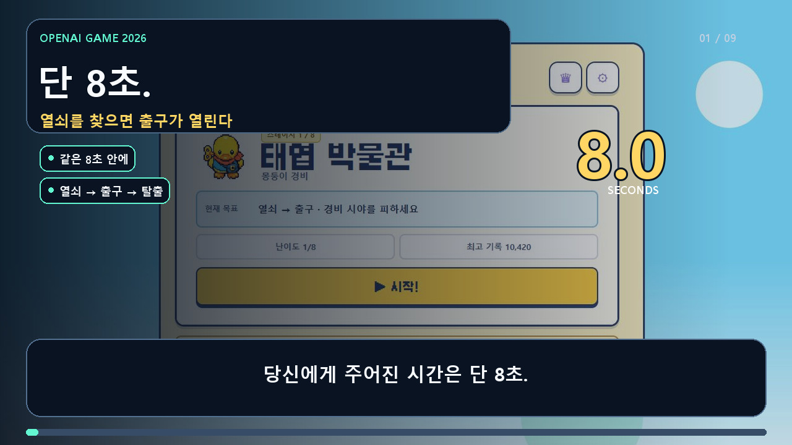

# 8초 도둑단

> **8초 전의 내가, 지금의 나를 돕는다.**
>
> 8초 동안 움직인 동선을 분신으로 저장하고 과거의 나와 역할을 나눠 열쇠를 찾는 1인 협동 잠입 퍼즐

**OPENAI GAME 2026 제출작 · v0.10.0**

[게임 바로 플레이](https://sdj3261.github.io/openai_game_2026/) · [3분 데모 영상](https://sdj3261.github.io/openai_game_2026/demo/) · [MP4 바로 보기](https://sdj3261.github.io/openai_game_2026/demo/8-second-crew-demo.mp4)

별도 설치·로그인·승인 없이 PC와 모바일 브라우저에서 바로 플레이할 수 있습니다.

[](https://sdj3261.github.io/openai_game_2026/demo/)

## 심사위원용 30초 안내

1. `시작!`을 누릅니다.
2. 방향키·`WASD` 또는 화면 조이스틱으로 이동합니다.
3. 한 차례는 8초입니다. 빨간 레이더를 피해 **이름표가 붙은 열쇠**를 찾습니다.
4. 열쇠를 얻으면 녹슨 자물쇠가 풀리고 출구가 초록색 `탈출!` 문으로 바뀝니다.
5. 열린 출구에 도착하면 성공합니다. 탈출에 필요한 조건은 열쇠뿐입니다.
6. 길이 막히면 `X 분신 만들기`로 현재 움직임을 저장하고, 다음 차례에 분신에게 발판을 맡깁니다. `Z 경비원 도발`은 현재 위치로 경비원을 불러오는 선택 기술입니다.

첫 스테이지는 잠입과 열쇠를, 두 번째는 경비원 도발을, 세 번째는 분신과 발판 협동을 가르칩니다.

## 핵심 규칙

```text
8초 차례 시작
        ↓
열쇠 획득
        ↓
출구 열림
        ↓
열린 출구로 탈출
```

- **8초 안에 열쇠 획득 → 출구 열림 → 탈출**이 모든 스테이지의 공통 목표입니다.
- `X`를 누르면 현재 차례의 이동 경로와 `Z 경비원 도발` 시점이 분신에 저장됩니다.
- 저장된 분신은 이후 차례마다 같은 행동을 동시에 반복합니다.
- 분신은 발판을 누르고, 저장된 경비원 도발을 반복하고, 연결된 문을 열어 둘 수 있습니다.
- `Z`와 분신 수는 탈출을 강제하는 조건이 아닙니다. 필요할 때 자유롭게 사용합니다.
- 분신은 최대 10개까지 만들 수 있습니다.
- 발각·재시작은 분신을 자동으로 만들지 않으며, 이미 저장한 분신은 유지됩니다.
- 8초가 끝나면 현재 기록이 멈춥니다. `X`로 저장하거나 `R`로 버리고 새 차례를 시작합니다.
- 열쇠는 현재 8초 차례에서만 유효합니다. `X`, `R`, 발각 또는 시간 종료로 새 차례가 시작되면 다시 찾아야 합니다.

### 처음 보는 단어

| 화면의 말 | 뜻 |
|---|---|
| `열쇠` | 현재 8초 안에 찾아야 하는 목표. 얻으면 출구가 열림 |
| `Z 경비원 도발` | 현재 위치로 경비원을 불러오는 선택 행동 |
| `X 분신 만들기` | 방금 이동과 경비원 도발을 반복하는 분신을 만들고 새 차례 시작 |
| `발판` | 분신을 세워 두면 연결된 중간 문이 열리는 바닥 스위치 |
| `출구` | 열쇠가 없으면 녹슨 자물쇠, 열쇠를 얻으면 초록색 열린 문 |

한 줄로 말하면 **열쇠만 있으면 탈출할 수 있고, 분신과 경비원 도발은 열쇠까지 가는 방법**입니다.

## 조작법

### PC

| 조작 | 기능 |
|---|---|
| 방향키 / `WASD` | 이동 |
| 게임 화면 클릭 | 클릭한 위치로 자동 이동 |
| `Z` | **경비원 도발**: 현재 위치로 경비원을 불러오기 |
| `X` | 현재 동선과 행동을 분신으로 저장하고 새 차례 시작 |
| `R` | 저장 없이 현재 차례 다시 시작 |
| `U` | 마지막 분신 지우기 |
| `Backspace` | 현재 스테이지를 첫 차례부터 초기화 |
| `M` | 소리 켜기·끄기 |
| `Esc` | 스테이지 선택 화면 |

### 모바일

- 왼쪽 조이스틱: 이동
- `Z 경비원 도발`: 현재 위치로 경비원 불러오기
- `X 분신 만들기`: 현재 행동을 분신으로 만들기
- 하단 버튼: 다시 시작, 분신 지우기, 스테이지 선택, 소리 설정

세로 화면에서는 플레이어 추적 카메라가 작동하고, 짧은 가로 화면에서는 게임과 조작기가 나란히 표시됩니다. 모든 주요 터치 영역은 최소 48px입니다.

## 화면에서 목표 읽기

| 표시 | 의미 |
|---|---|
| 빛나는 열쇠와 이름표 | 현재 차례에 반드시 찾아야 하는 열쇠. 열쇠 점수가 최종 점수에 더해짐 |
| 녹슨 자물쇠와 `열쇠 필요` | 열쇠를 얻기 전에는 열리지 않는 출구 |
| 초록 화살표와 `탈출!` | 열쇠 획득 후 열린 최종 목적지 |
| `발판 1/2 · X 저장` | 그 자리에서 `X`를 눌러 분신을 세우고 연결된 문을 여는 바닥 스위치 |
| 빨간 부채꼴 | 경비의 실제 레이더 범위. 벽과 닫힌 문에서 정확히 잘림 |

레이더 그림과 실제 발각 판정은 같은 기하 데이터를 사용합니다. 벽 너머에 닿지 않은 레이더로는 잡히지 않습니다.

## 열쇠와 선택 아이템

각 스테이지의 열쇠는 출구를 여는 필수 목표이며, 열쇠 점수는 최종 점수에 자동으로 더해집니다.

| 단계 | 열쇠 | 점수 |
|---:|---|---:|
| 1 | 태엽 열쇠 | +300점 |
| 2 | 황동 열쇠 | +400점 |
| 3 | 캔디 열쇠 | +500점 |
| 4 | 구름 열쇠 | +600점 |
| 5 | 달빛 열쇠 | +700점 |
| 6 | 거울 열쇠 | +800점 |
| 7 | 왕실 열쇠 | +900점 |
| 8 | 자정 열쇠 | +1,200점 |

선택 아이템은 현재 스테이지 도전 중 한 번만 획득할 수 있습니다.

- `시간 태엽`: 현재와 이후 차례의 제한시간 +1.5초, 수집 보너스 +150점
- `레이더 보호막`: 다음 레이더 노출 1회를 막고 수집 보너스 +250점. 경비·화살·그물과 직접 부딪히는 것은 막지 못함
- `보너스 조각`: 스테이지에 따라 +300·+400·+600·+800점

선택 아이템은 `X`, `R`, 발각, 시간 종료 뒤에도 현재 스테이지 동안 유지됩니다. `Backspace`로 스테이지 전체를 초기화하면 사라집니다. 열쇠는 선택 아이템과 달리 현재 8초 차례에만 유효하며, 새 차례가 시작되면 초기화됩니다.

## 8개 스테이지

| 단계 | 장소 | 핵심 요소와 선택 아이템 | 경비 | 권장 분신 |
|---:|---|---|---:|---:|
| 1 | 태엽 박물관 | 몽둥이 순찰병 · 보너스 조각 +300 | 1 | 0 |
| 2 | 장난감 공장 | 소리를 듣는 경비 · 레이더 보호막 | 1 | 0 |
| 3 | 캔디 아케이드 | 장난감 궁수와 발판 문 · 시간 태엽 +1.5초 | 2 | 1 |
| 4 | 구름 연구실 | 두 발판과 회전 탐조등 · 보너스 조각 +400 | 2 | 2 |
| 5 | 달빛 역 | 그물총 추격병 · 시간 태엽 +1.5초 | 3 | 1 |
| 6 | 거울 성 | 두 문과 역회전 탐조등 · 보호막 | 3 | 2 |
| 7 | 왕실 금고 | 경비대장과 두 분신 역할 분담 · 보너스 조각 +600 | 4 | 2 |
| 8 | 자정 시계탑 | 두 발판과 보스 경비대장 · 시간 태엽·보호막·보너스 조각 +800 | 4 | 2 |

방해꾼은 몽둥이 순찰병 → 소리를 듣는 경비 → 장난감 궁수 → 회전 탐조등병 → 그물총 추격병 → 경비대장 순서로 점진적으로 추가됩니다. 궁수는 0.5초 조준 뒤 빠르고 낮은 포물선의 화살을, 추격병은 0.65초 예고 뒤 느리고 높은 포물선의 그물탄을 발사합니다. 두 탄은 목표 위치를 미리 고정하고 벽과 닫힌 문에 막히므로 예고선을 보고 피할 수 있습니다.

각 스테이지는 서로 다른 장소색과 8초 칩튠을 사용합니다. BGM은 90 BPM에서 195 BPM까지 빨라지고, 정확히 8초마다 새 차례와 함께 첫 박으로 돌아갑니다.

## 점수와 기기 랭킹

최종 점수는 **잠입 점수 + 필수 열쇠 점수 + 선택 아이템 보너스**입니다.

```text
잠입 점수
= max(0, 10,000
  - 레이더 노출 × 1,200
  - 재시도 × 650
  - min(권장 초과 분신, 2) × 250
  - max(권장 초과 분신 - 2, 0) × 500
  - 성공 차례의 5초 초과 시간 10ms당 1점)

최종 점수
= min(20,000, 잠입 점수 + 열쇠 점수 + 아이템 보너스)
```

| 항목 | 계산 |
|---|---:|
| 잠입 기본 점수 | 10,000점 |
| 레이더에 새로 노출된 구간 | 1회당 −1,200점 |
| 발각·`R` 재시작 | 1회당 −650점 |
| 권장 수를 넘긴 첫 2개 분신 | 1개당 −250점 |
| 권장 수를 넘긴 세 번째 이후 분신 | 1개당 −500점 |
| 성공한 차례의 5초 초과 시간 | 1초당 −100점 |
| 필수 열쇠 | 스테이지에 따라 +300~+1,200점 |
| 시간 태엽 / 보호막 | 각각 +150점 / +250점 |
| 보너스 조각 | 스테이지에 따라 +300·+400·+600·+800점 |

수집 점수는 기록 경쟁의 총점에 반영하지만 실수를 가리지는 않습니다. 랭크는 잠입 점수만으로 `S 9,000 이상`, `A 7,500 이상`, `B 6,000 이상`, 그 이하는 `C`입니다. 랭킹은 총점이 높은 순이며, 동점은 레이더 노출 → 재시도 → 분신 수 → 완료 시간이 적은 기록 순으로 정렬합니다.

프로필 이름·색상·표정을 설정할 수 있으며, 도전·클리어·발각·분신 통계와 스테이지별 상위 5개 기록을 확인할 수 있습니다.

현재 순위는 서버 순위가 아닌 **같은 브라우저·기기의 기록 비교**입니다. 브라우저 데이터를 삭제하면 기록도 초기화됩니다.

## 접근성 및 언어

- 한국어·영어·일본어 지원
- 효과음과 발생 방향을 표시하는 소리 자막
- 색 외에도 문구·아이콘·경비 실루엣으로 상태 구분
- 키보드, 클릭 이동, 터치 조이스틱 지원
- 운영체제의 `prefers-reduced-motion` 설정 반영
- 키보드 포커스, 스킵 링크, 상태 안내용 ARIA 라이브 영역 제공

## 본선 심사 기준별 구현 근거

| 심사 기준 | 제출 빌드의 근거 |
|---|---|
| **Playability** | 공개 HTTPS 웹 빌드, PC·모바일 조작, 8개 완성 스테이지, 점수·진행 저장, 45개 단위 테스트와 정적 빌드 스모크 검사 |
| **Originality** | 이동·경비원 도발 타이밍을 재생하는 분신으로 혼자서 과거의 나와 역할을 분담하는 8초 잠입 퍼즐 |
| **Codex Collaboration** | 8초 행동 반복, 레이더·충돌 판정, 반응형 UI, 다국어, 점수·기록, 스프라이트 생성·후처리·QC와 자동 검사를 Codex와 반복 개발 |
| **Release Potential** | 설치 없는 정적 웹, 모바일 대응, 독립된 점수·랭킹 로직, 3개 언어와 데이터형 스테이지를 기반으로 HIVE 계정·서버 랭킹·클라우드 저장·시즌 스테이지로 확장 가능 |
| **Presentation** | 즉시 실행 링크, 상세 조작 안내, 음성·자막이 포함된 3분 데모, 디자인·에셋 생성 근거, 재현 가능한 테스트 명령 제공 |

## Codex와 어떻게 만들었나요?

### 사람이 직접 결정한 부분

- “8초 전의 나와 협동하는 잠입 퍼즐”이라는 최종 게임 방향
- `SIMPLE IS BEST`를 기준으로 한 메뉴와 조작의 우선순위
- `경비원 도발`, `분신 만들기`, `발판`처럼 행동과 결과가 바로 보이는 용어
- 경비 종류, 보스, 스테이지별 점진적 난이도와 점수 기준
- 모바일 조작, 다국어, 소리 자막과 실제 플레이 피드백
- 열쇠·녹슨 자물쇠·활성 출구처럼 즉시 읽히는 시각 언어

### Codex가 맡은 부분

- Canvas 2D 기반 코어 게임과 8초 행동 기록·재생 시스템 구현
- 벽에 의해 잘리는 레이더 시야와 실제 발각 판정의 일치
- 경비 순찰·청각·회전·추격·보스 행동 구현
- 화살·그물탄의 프레임 독립 포물선, 예고선, 벽 차단, 연속 충돌 판정 구현
- 반응형 PC·모바일 UI와 터치 조작 구현
- 프로필·통계·점수·기기 랭킹 및 다국어 모듈 구현
- 캐릭터 원본 생성과 Agent Sprite Forge 후처리·QC
- 테스트 작성, 반복 QA, GitHub Pages 자동 배포

### 저장소에서 확인할 수 있는 근거

- [게임 코어](./game.js)
- [열쇠 탈출·분신 제한 규칙](./game-rules.js)
- [점수·프로필·랭킹](./profile-utils.js)
- [모바일 입력](./input-utils.js)
- [3개 언어](./i18n.js)
- [디자인 원칙](./DESIGN_SYSTEM.md)
- [오리 주인공 생성 프롬프트](./assets/sprites/duck-player/down/prompt-used.txt) / [QC](./assets/sprites/duck-player/down/pipeline-meta.json)
- [인간형 경비대장 생성 프롬프트](./assets/sprites/toy-guards/captain/prompt-used.txt) / [QC](./assets/sprites/toy-guards/captain/pipeline-meta.json)
- [전체 스프라이트 제작 기록](./assets/sprites/ASSET-PROVENANCE.md)
- [자동 배포](./.github/workflows/pages.yml)

## 3분 데모 구성

| 구간 | 내용 |
|---|---|
| 00:00–00:16 | 8초 제한과 게임 목표 오프닝 |
| 00:16–00:35 | `Z 경비원 도발`·`X 분신 만들기` 조작 |
| 00:35–00:53 | `X 분신` 저장과 발판 협동 |
| 00:53–01:11 | 정확한 레이더 판정과 경비 종류 |
| 01:11–01:28 | 8개 스테이지의 점진적 난이도 |
| 01:28–01:46 | 최종 보스와 분신 협동 작전 |
| 01:47–02:06 | 열쇠·아이템·잠입 점수와 기기 랭킹 |
| 02:07–02:28 | Codex 협업·모바일·접근성 QA |
| 02:28–02:46 | 설치 없는 플레이 CTA |

[영상 뷰어](https://sdj3261.github.io/openai_game_2026/demo/)에서 한국어 음성·자막과 함께 볼 수 있으며, [대본](./demo/script.md)과 [SRT 자막](./demo/8-second-crew-demo.srt)도 저장소에 포함합니다.

> v0.10.0 영상과 게임은 `Z 경비원 도발`, `X 분신 만들기`, `열쇠 → 출구 → 탈출`이라는 같은 용어와 규칙을 사용합니다. `Z`와 분신 수는 탈출 강제조건이 아닙니다.

## 현재 구현 범위와 출시 확장

| 현재 제출 빌드 | 출시 이후 확장 |
|---|---|
| 브라우저 `localStorage` 프로필·진행 저장 | HIVE 계정과 클라우드 저장 |
| 같은 기기의 스테이지 기록 비교 | 서버 전체·친구·시즌 랭킹 |
| 8개 싱글 플레이 스테이지 | 시즌별 스테이지·보스·경비 팩 |
| 비동기 분신 협동 | 다른 유저의 기록 분신과 도전하는 비동기 협동 |
| 한국어·영어·일본어 | 운영 지역에 맞춘 추가 언어 |

HIVE 연동과 서버형 전체 랭킹은 **출시 이후 확장 계획**이며 현재 제출 빌드에 구현된 기능으로 표시하지 않습니다.

## 로컬 실행

Node.js 18 이상이 필요합니다. 별도 패키지 설치는 필요하지 않습니다.

```powershell
git clone https://github.com/sdj3261/openai_game_2026.git
cd openai_game_2026
npm start
```

브라우저에서 `http://127.0.0.1:4173`을 엽니다.

### 휴대폰으로 로컬 테스트

```powershell
npm run start:mobile
```

PC와 휴대폰을 같은 신뢰할 수 있는 Wi-Fi에 연결하고 터미널의 `mobile/LAN URLs` 주소를 엽니다.

## QA

```powershell
npm test
```

v0.10.0 자동 검사는 단위 테스트 총 45개와 정적 빌드 스모크 검사로 구성됩니다.

- 입력 테스트 6개
- 열쇠 탈출·분신 제한 규칙 테스트 2개
- 프로필·점수·랭킹 테스트 20개
- 다국어 테스트 6개
- 화살·그물탄 물리·충돌 테스트 11개
- 스모크 검사: HTTP 200, 버전, 정적 에셋, 모바일 UI, 글꼴, 오리 주인공 4방향·인간형 경비 6종 스프라이트 QC

자동 검사는 핵심 유틸리티와 배포 에셋을 검증합니다. 전체 플레이 감각과 모든 스테이지 완주는 별도의 브라우저 플레이 QA 대상입니다.

## 기술 구성

| 영역 | 기술 |
|---|---|
| 게임 | Vanilla JavaScript ES Modules, Canvas 2D |
| 사운드 | Web Audio API로 합성한 스테이지별 8초 칩튠 |
| UI | HTML, CSS 디자인 토큰, 반응형 레이아웃 |
| 저장 | 브라우저 `localStorage` |
| 로컬 서버 | Node.js 내장 HTTP 서버 |
| 배포 | GitHub Actions, GitHub Pages |
| 테스트 | Node.js Test Runner, 정적 스모크 검사 |

## 시각 에셋과 라이선스

오리 주인공과 인간형 경비 6종 원본은 이미지 생성으로 제작한 뒤 Agent Sprite Forge의 `generate2dsprite` 프로세서로 배경 제거, 프레임 분할, 정렬, 투명 PNG·GIF 내보내기와 QC를 수행했습니다.

원본 시트, 투명 시트, 개별 프레임, 사용 프롬프트와 검사 메타데이터를 `assets/sprites`에 함께 보관했습니다.

한글 게임 글꼴은 SIL Open Font License 1.1의 Galmuri11 Bold이며 [라이선스 원문](./assets/fonts/OFL-Galmuri.txt)을 포함합니다. 프로젝트 코드 자체에는 별도 라이선스가 부여되어 있지 않습니다.
